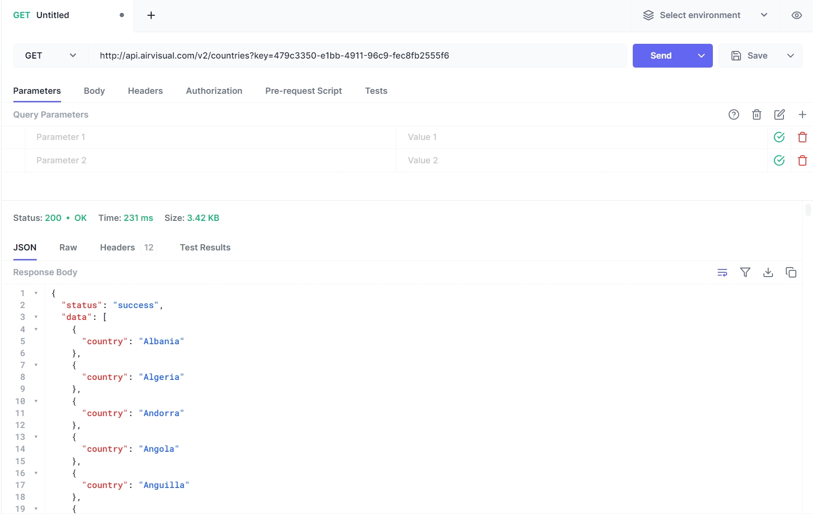

# CSC207Week3GroupWork - Chat System with Weather Feature

## Run
Go to the folder "CSC207Week3GroupWork/src/test/java/ApiCaller.java" and click run.

## Problem Domain
Our team is focusing on the domain of real-time communication augmented with contextual information. In today's digital age, effective and enriched communication platforms are crucial for both personal and professional interactions. Our application aims to enhance user interaction by providing real-time weather updates within a chat interface.

## Project Description
We are developing a chat system where users can communicate in real-time. A distinctive feature of our chat system is its ability to provide current weather information based on the location shared or mentioned in the chat. This feature could be beneficial for users planning outdoor activities, discussing travel plans, or simply wanting to share the weather conditions with others.

## API Documentation
For fetching real-time weather data, we plan to utilize the [IQAir API](https://www.iqair.com/air-pollution-data-api). This API provides comprehensive data on air quality, which will be displayed within our chat system when triggered by user input.

## API Testing
We used [hoppscotch](https://hoppscotch.io/) to test the IQAir API and ensure it provides accurate and timely weather data. Below is a screenshot of our API testing which outputs supported countries in this API:


## Example Output
Below is an example output from our Java program, demonstrating the nearest city data (IP geolocation):
```plaintext
{"status":"success","data":{"city":"East York","state":"Ontario","country":"Canada","location":{"type":"Point","coordinates":[-79.32794,43.69053]},"current":{"pollution":{"ts":"2023-XX-XX9T21:00:00.000Z","aqius":41,"mainus":"p2","aqicn":14,"maincn":"p2"},"weather":{"ts":"2023-XX-XXT21:00:00.000Z","tp":19,"pr":1021,"hu":71,"ws":0.89,"wd":121,"ic":"01d"}}}}

